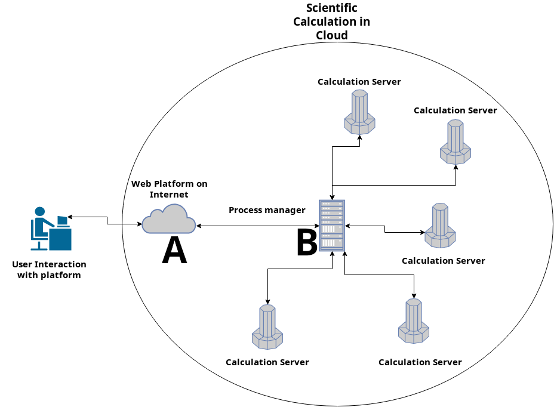

# Django_web_platform

## Requisitos Previos de Instalación para la Plataforma 

### Instalar pip 
  ```sudo apt-get install python3-pip```
### Instalar  Entorno Virtual (virtualenv)
  ```sudo pip3 install virtualenv``` 
### Instalar Django 2
  ```pip install Django==2.1.2```
  
## Insatalar Proyecto (Plataforma_web)

### Crear un entorno virtual de Python con virtualenv

  Para ejecutar el Pryecto es necesario crear un entorno Virtual para ello 
  ubiquémonos en el directorio del Proyecto  y ejecutar el comando que se muestra
  a continuación:
  
  ```virtualenv -p python3.5 venv```
### Activar un entorno virtual 
  ```source venv/bin/activate```
  
  Una vez activado el Entorno Virtual instalamos los siguientes paquetes para 
  poder hacer uso de peticiones curl, íconos y forms bootstrap.
### Instalar paquetes para el Proyecto (Django)
 
  Instalar los sigueintes paquetes para el correcto funcionamiento:
  
  1. ```pip install urllib3``` 
  2. ```pip install django-bootstrap-form```
  3. ```pip install django-fontawesome```

### Configurar Base de Datos
#### Crear tablas de la Base de Datos
  ```python manage.py makemigrations```
#### Copiar todo el contenido multimedia(imágenes, gifs, videos...)
  ```python manage.py collectstatic```
#### Crear Super Usuario Django (una vez activado el entorno virtual)
  ```python manage.py createsuperuser```
  
  Una vez ingresado este comando nos pedrirá que registremos nuestras credenciales
  
  Ingresamos los siguientes datos:
  1. username
  2. email
  3. password

## Arquitectura del Proyecto HiPeCC
   


## Estructura de directorios del proyecto
```javascript
HipiCC/
├── untitled
│   
├── workspace
├── Plataforma_web
│   ├── static
│   ├── templates
│   └── migrations
└── data
```  

## Preparar la plataforma para poner en Produccón
  Para poner en Servicio en modo Producción es necesario hacer unas pequeñas 
  modificaciones dentro del archivo __settings.py__. Para que la página sepa a
  quien mandarle las peticiones de cálculo de alto rendimiento, y por que puerto 
  va a recibir las peticiones. Para esto es necesario indicarle la Dirección IP
  del Servidor de Cálculo de Alto Rendimiento y el número de Puerto. 
  
  Basta con modificar las variables __DIR_IP__ y __PUERTO__ con los valores 
  correspondientes.
  
  Por ejemplo si la Dirección IP del Servidor de Cálculo de Alto Rendimiento es
  __192.168.2.45__ y queremos que reciba peticiones por el puerto __5002__ las 
  variables quedarian así:
  
  __DIR_IP = '192.168.2.45:'__
  
  __PUERTO = '5002'__
  
  Nota: La Dirección IP al final lleva dos puntos.
    
## Instalación de paquetes para poner en Producción
  1. Instalar Servidor Web NginX (para peticiones de archivos multimedia (html, 
  css, images, ...))

  ```sudo apt-get install nginx```
  
  2. Instalar Servidor Web de Contenido Dinámico (para peticiones de lógica) una 
  vez activado el Entorno Virtual 

  ```pip install gunicorn```
  
  Nota: Instalar el Paquete gunicorn dentro del Entorno Virtual del proyecto.

## Configurar gunicorn

  Para configurar el servidor UNICORN, es necesario que te encuentres dentro del
  directorio del Proyeccto y activar el entorno virtual, una vez que estés ubicado 
  ahí, ejecuta el siguiente comando:
  
  ```gunicorn --bind 0.0.0.0:8800 [project_name].wsgi:application```
  
  Una vez ejecutado el siguiente comando podemos ver nuestro sitio en funcionamiento 
  pero sin los estilos e imágenes, asi que detenemos el servicio y hacemos lo que se 
  muestra a continuación. 
  
  Después, para finalizar de configurar gunicorn necesitamos crear un scrit que 
  inicié cada vez que se inicie el sistema. Para ello ejecutamos el siguiente 
  comando:
  
  ```sudo nano /etc/systemd/system/gunicorn.service```
  
  y pegar el contenido que se muestra abajo.
  
  ```[script]
[Unit]
Description=gunicorn service
After=network.target
   
[Service]
User=username
Group=www-data
WorkingDirectory=/home/username/projets/HiPiCC
ExecStart=/home/username/projets/HiPiCC/venv/bin/gunicorn --access-logfile - --workers 3 --bind unix:/home/username/projets/HiPiCC/untitled/untitled.sock untitled.wsgi:application
   
[Install]
WantedBy=multi-user.target
  
  
  ```
  donde tenemos que modificar la ruta, por la ruta donde se ubica nuestro proyecto.
  
  
  Una vez quie se haya completado los camobios en el arvhivo anterior. Ejecutamos 
  los siguientes comandos:
  
  1. ```sudo systemctl enable gunicorn.service```
  2. ```sudo systemctl start gunicorn.service```
  3. ```sudo systemctl status gunicorn.service```
  

## Configurar NginX 

### Crear un archivo de configuración

  Para configurar NginX debes de crear un archivo de configuración que le dirá
  a NginX cómo responder al as peticiones del cliente. Para ello creamos un archivo 
  como se indica a continuación.
  
  ```sudo nano /etc/nginx/sites-available/[project_name]```
  
  Una vez creado el Archivo, copiar el sigueinte contenido, cambiando la ruta por
  la correspondiente al proyecto:
 

 ```[script]

    server {
       listen 80;    
       server_name 127.0.0.1;
       location /favicon.ico {access_log off;log_not_found off;} 
       
       location /static/ {
         root /home/username/projets/HiPiCC;    
       }
       location /media/ {
         root /home/username/projets/HiPiCC;
       }
       
       location / {
         include proxy_params;
         proxy_pass http://unix:/home/username/projets/HiPiCC/untitled/untitled.sock;
       }
     }

  ```
 
  La primera línea le dice a NginX por que puerto escuchar, la segunda provee la
  dirección IP con la cual va responder las peticiones, escribe la Dirección IP o 
  la Dirección DNS. 
  
  La primera variable location le comunica a NginX donde encontrar favicon.ico e
  ignorar errores si no lo encuentra. La segundan y tercera variable location le 
  comunica a NginX donde encontrar los archivos estáticos y multimedia respectivamente
  La última variable location le comunica a NginX las demás peticiones.
  
  Si configuraste todo correctamente, ejecuta el siguiente comando:
  
  ```sudo ln -s /etc/nginx/sites-available/[project_name] /etc/nginx/sites-enabled```
  
  el cual añadirá un link al archivo de configuración que hemos creado anteriormente,
  de tal manera que NginX lo reconozca.
  
  Ejecuta el sigueinte comando para hacer una prueba a la configuración que hemos 
  creado. 
  
  ```sudo nginx -t```
  
  Si todo va bien Reinicia NginX con el sigueinte comando.
  
  ```sudo systemctl restart nginx```
  
  Antes de finalizar, necesitamos cambiar algunas reglas del Firewall y liberar el 
  puerto a emplear, en este caso, el puerto 80. Esto se logra con los siguientes comandos:
  
  ```
  sudo ufw delete allow 8800
  sudo ufw allow 'Nginx Full'
  ```
  Si todo va bien hasta ahora, Puedes ahora abrir el navegador de tu preferencia 
  e ir a la Direccion IP o nombre de
  Dominio y ver tu Applicacion.
  
  
  
  